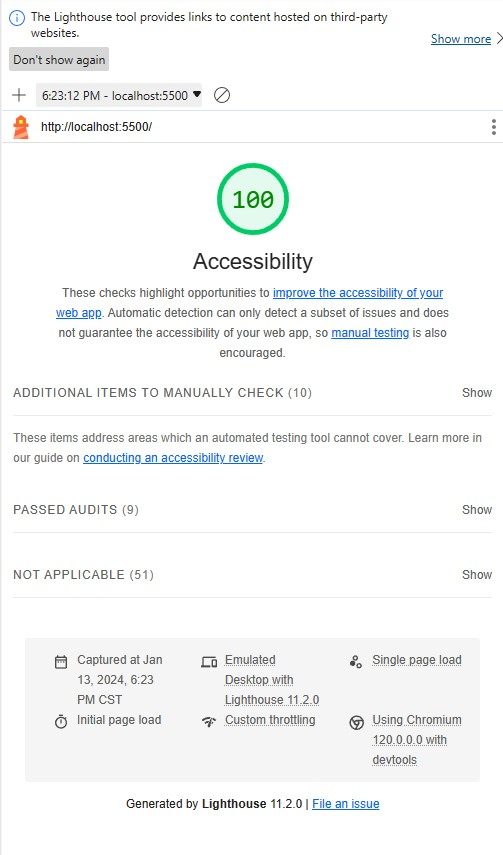

# Synopsis

This is the project for module 01 lab 05b. The program will ask you 7 questions!

## Code Example

Doubt there will be example code because no functions will be exposed.

## Motivation

I want to graduate!

## Installation

Grab the project by:

`git clone https://github.com/CodeHard84/mod01c02.git`

## API Reference

No API.

## Tests

No tests.

## Contributors

Me

## License

MIT

## Lighthouse

